final project
================
2025-05-11

``` r
#Loading neccessary packges*
library(ggplot2)
```

    ## Warning: package 'ggplot2' was built under R version 4.4.3

``` r
install.packages
```

    ## function (pkgs, lib, repos = getOption("repos"), contriburl = contrib.url(repos, 
    ##     type), method, available = NULL, destdir = NULL, dependencies = NA, 
    ##     type = getOption("pkgType"), configure.args = getOption("configure.args"), 
    ##     configure.vars = getOption("configure.vars"), clean = FALSE, 
    ##     Ncpus = getOption("Ncpus", 1L), verbose = getOption("verbose"), 
    ##     libs_only = FALSE, INSTALL_opts, quiet = FALSE, keep_outputs = FALSE, 
    ##     ...) 
    ## {
    ##     if (!(is.character(type) && length(type) == 1L)) 
    ##         stop(gettextf("'%s' must be a character string", "type"), 
    ##             domain = NA)
    ##     type2 <- .Platform$pkgType
    ##     if (type == "binary") {
    ##         if (type2 == "source") 
    ##             stop("type 'binary' is not supported on this platform")
    ##         else type <- type2
    ##         if (type == "both" && (!missing(contriburl) || !is.null(available))) 
    ##             stop("specifying 'contriburl' or 'available' requires a single type, not type = \"both\"")
    ##     }
    ##     if (is.logical(clean) && clean) 
    ##         clean <- "--clean"
    ##     if (is.logical(dependencies) && is.na(dependencies)) 
    ##         dependencies <- if (!missing(lib) && length(lib) > 1L) 
    ##             FALSE
    ##         else c("Depends", "Imports", "LinkingTo")
    ##     get_package_name <- function(pkg) {
    ##         gsub("_[.](zip|tar[.]gz|tar[.]bzip2|tar[.]xz)", "", gsub(.standard_regexps()$valid_package_version, 
    ##             "", basename(pkg)))
    ##     }
    ##     getConfigureArgs <- function(pkg) {
    ##         if (.Platform$OS.type == "windows") 
    ##             return(character())
    ##         if (length(pkgs) == 1L && length(configure.args) && length(names(configure.args)) == 
    ##             0L) 
    ##             return(paste0("--configure-args=", shQuote(paste(configure.args, 
    ##                 collapse = " "))))
    ##         pkg <- get_package_name(pkg)
    ##         if (length(configure.args) && length(names(configure.args)) && 
    ##             pkg %in% names(configure.args)) 
    ##             config <- paste0("--configure-args=", shQuote(paste(configure.args[[pkg]], 
    ##                 collapse = " ")))
    ##         else config <- character()
    ##         config
    ##     }
    ##     getConfigureVars <- function(pkg) {
    ##         if (.Platform$OS.type == "windows") 
    ##             return(character())
    ##         if (length(pkgs) == 1L && length(configure.vars) && length(names(configure.vars)) == 
    ##             0L) 
    ##             return(paste0("--configure-vars=", shQuote(paste(configure.vars, 
    ##                 collapse = " "))))
    ##         pkg <- get_package_name(pkg)
    ##         if (length(configure.vars) && length(names(configure.vars)) && 
    ##             pkg %in% names(configure.vars)) 
    ##             config <- paste0("--configure-vars=", shQuote(paste(configure.vars[[pkg]], 
    ##                 collapse = " ")))
    ##         else config <- character()
    ##         config
    ##     }
    ##     get_install_opts <- function(pkg) {
    ##         if (!length(INSTALL_opts)) 
    ##             character()
    ##         else paste(INSTALL_opts[[get_package_name(pkg)]], collapse = " ")
    ##     }
    ##     if (missing(pkgs)) {
    ##         if (!interactive()) 
    ##             stop("no packages were specified")
    ##         if (.Platform$OS.type == "windows" || .Platform$GUI == 
    ##             "AQUA" || (capabilities("tcltk") && capabilities("X11") && 
    ##             suppressWarnings(tcltk::.TkUp))) {
    ##         }
    ##         else stop("no packages were specified")
    ##         if (is.null(available)) {
    ##             av <- available.packages(contriburl = contriburl, 
    ##                 method = method, ...)
    ##             if (missing(repos)) 
    ##                 repos <- getOption("repos")
    ##             if (type != "both") 
    ##                 available <- av
    ##         }
    ##         else av <- available
    ##         if (NROW(av)) {
    ##             pkgs <- select.list(sort(unique(rownames(av))), multiple = TRUE, 
    ##                 title = "Packages", graphics = TRUE)
    ##         }
    ##     }
    ##     if (.Platform$OS.type == "windows" && length(pkgs)) {
    ##         pkgnames <- get_package_name(pkgs)
    ##         inuse <- search()
    ##         inuse <- sub("^package:", "", inuse[grep("^package:", 
    ##             inuse)])
    ##         inuse <- pkgnames %in% inuse
    ##         if (any(inuse)) {
    ##             warning(sprintf(ngettext(sum(inuse), "package %s is in use and will not be installed", 
    ##                 "packages %s are in use and will not be installed"), 
    ##                 paste(sQuote(pkgnames[inuse]), collapse = ", ")), 
    ##                 call. = FALSE, domain = NA, immediate. = TRUE)
    ##             pkgs <- pkgs[!inuse]
    ##         }
    ##     }
    ##     if (!length(pkgs)) 
    ##         return(invisible())
    ##     if (missing(lib) || is.null(lib)) {
    ##         lib <- .libPaths()[1L]
    ##         if (!quiet && length(.libPaths()) > 1L) 
    ##             message(sprintf(ngettext(length(pkgs), "Installing package into %s\n(as %s is unspecified)", 
    ##                 "Installing packages into %s\n(as %s is unspecified)"), 
    ##                 sQuote(lib), sQuote("lib")), domain = NA)
    ##     }
    ##     ok <- dir.exists(lib) & (file.access(lib, 2) == 0L)
    ##     if (length(lib) > 1 && any(!ok)) 
    ##         stop(sprintf(ngettext(sum(!ok), "'lib' element %s is not a writable directory", 
    ##             "'lib' elements %s are not writable directories"), 
    ##             paste(sQuote(lib[!ok]), collapse = ", ")), domain = NA)
    ##     if (length(lib) == 1L && .Platform$OS.type == "windows") {
    ##         ok <- dir.exists(lib)
    ##         if (ok) {
    ##             fn <- file.path(lib, paste0("_test_dir_", Sys.getpid()))
    ##             unlink(fn, recursive = TRUE)
    ##             res <- try(dir.create(fn, showWarnings = FALSE))
    ##             if (inherits(res, "try-error") || !res) 
    ##                 ok <- FALSE
    ##             else unlink(fn, recursive = TRUE)
    ##         }
    ##     }
    ##     if (length(lib) == 1L && !ok) {
    ##         warning(gettextf("'lib = \"%s\"' is not writable", lib), 
    ##             domain = NA, immediate. = TRUE)
    ##         userdir <- unlist(strsplit(Sys.getenv("R_LIBS_USER"), 
    ##             .Platform$path.sep))[1L]
    ##         if (interactive()) {
    ##             ans <- askYesNo(gettext("Would you like to use a personal library instead?"), 
    ##                 default = FALSE)
    ##             if (!isTRUE(ans)) 
    ##                 stop("unable to install packages")
    ##             lib <- userdir
    ##             if (!file.exists(userdir)) {
    ##                 ans <- askYesNo(gettextf("Would you like to create a personal library\n%s\nto install packages into?", 
    ##                   sQuote(userdir)), default = FALSE)
    ##                 if (!isTRUE(ans)) 
    ##                   stop("unable to install packages")
    ##                 if (!dir.create(userdir, recursive = TRUE)) 
    ##                   stop(gettextf("unable to create %s", sQuote(userdir)), 
    ##                     domain = NA)
    ##                 .libPaths(c(userdir, .libPaths()))
    ##             }
    ##         }
    ##         else stop("unable to install packages")
    ##     }
    ##     lib <- normalizePath(lib)
    ##     if (length(pkgs) == 1L && missing(repos) && missing(contriburl)) {
    ##         if ((type == "source" && any(grepl("[.]tar[.](gz|bz2|xz)$", 
    ##             pkgs))) || (type %in% "win.binary" && endsWith(pkgs, 
    ##             ".zip")) || (startsWith(type, "mac.binary") && endsWith(pkgs, 
    ##             ".tgz"))) {
    ##             repos <- NULL
    ##             message("inferring 'repos = NULL' from 'pkgs'")
    ##         }
    ##         if (type == "both") {
    ##             if (type2 %in% "win.binary" && endsWith(pkgs, ".zip")) {
    ##                 repos <- NULL
    ##                 type <- type2
    ##                 message("inferring 'repos = NULL' from 'pkgs'")
    ##             }
    ##             else if (startsWith(type2, "mac.binary") && endsWith(pkgs, 
    ##                 ".tgz")) {
    ##                 repos <- NULL
    ##                 type <- type2
    ##                 message("inferring 'repos = NULL' from 'pkgs'")
    ##             }
    ##             else if (grepl("[.]tar[.](gz|bz2|xz)$", pkgs)) {
    ##                 repos <- NULL
    ##                 type <- "source"
    ##                 message("inferring 'repos = NULL' from 'pkgs'")
    ##             }
    ##         }
    ##     }
    ##     if (length(pkgs) == 1L && is.null(repos) && type == "both") {
    ##         if ((type2 %in% "win.binary" && endsWith(pkgs, ".zip")) || 
    ##             (startsWith(type2, "mac.binary") && endsWith(pkgs, 
    ##                 ".tgz"))) {
    ##             type <- type2
    ##         }
    ##         else if (grepl("[.]tar[.](gz|bz2|xz)$", pkgs)) {
    ##             type <- "source"
    ##         }
    ##     }
    ##     if (is.null(repos) && missing(contriburl)) {
    ##         tmpd <- destdir
    ##         nonlocalrepos <- any(web <- grepl("^(http|https|ftp)://", 
    ##             pkgs))
    ##         if (is.null(destdir) && nonlocalrepos) {
    ##             tmpd <- file.path(tempdir(), "downloaded_packages")
    ##             if (!file.exists(tmpd) && !dir.create(tmpd)) 
    ##                 stop(gettextf("unable to create temporary directory %s", 
    ##                   sQuote(tmpd)), domain = NA)
    ##         }
    ##         if (nonlocalrepos) {
    ##             df <- function(p, destfile, method, ...) download.file(p, 
    ##                 destfile, method, mode = "wb", ...)
    ##             urls <- pkgs[web]
    ##             for (p in unique(urls)) {
    ##                 this <- pkgs == p
    ##                 destfile <- file.path(tmpd, basename(p))
    ##                 res <- try(df(p, destfile, method, ...))
    ##                 if (!inherits(res, "try-error") && res == 0L) 
    ##                   pkgs[this] <- destfile
    ##                 else {
    ##                   pkgs[this] <- NA
    ##                 }
    ##             }
    ##         }
    ##     }
    ##     if (type == "both") {
    ##         if (type2 == "source") 
    ##             stop("type == \"both\" can only be used on Windows or a CRAN build for macOS")
    ##         if (!missing(contriburl) || !is.null(available)) 
    ##             type <- type2
    ##     }
    ##     getDeps <- TRUE
    ##     if (type == "both") {
    ##         if (is.null(repos)) 
    ##             stop("type == \"both\" cannot be used with 'repos = NULL'")
    ##         type <- "source"
    ##         contriburl <- contrib.url(repos, "source")
    ##         if (missing(repos)) 
    ##             repos <- getOption("repos")
    ##         available <- available.packages(contriburl = contriburl, 
    ##             method = method, fields = "NeedsCompilation", ...)
    ##         pkgs <- getDependencies(pkgs, dependencies, available, 
    ##             lib, ...)
    ##         getDeps <- FALSE
    ##         av2 <- available.packages(contriburl = contrib.url(repos, 
    ##             type2), method = method, ...)
    ##         bins <- row.names(av2)
    ##         bins <- pkgs[pkgs %in% bins]
    ##         srcOnly <- pkgs[!pkgs %in% bins]
    ##         binvers <- av2[bins, "Version"]
    ##         hasArchs <- !is.na(av2[bins, "Archs"])
    ##         needsCmp <- !(available[bins, "NeedsCompilation"] %in% 
    ##             "no")
    ##         hasSrc <- hasArchs | needsCmp
    ##         srcvers <- available[bins, "Version"]
    ##         later <- as.numeric_version(binvers) < srcvers
    ##         action <- getOption("install.packages.compile.from.source", 
    ##             "interactive")
    ##         if (!nzchar(Sys.which(Sys.getenv("MAKE", "make")))) 
    ##             action <- "never"
    ##         if (grepl("darwin", R.version$platform) && !length(srcOnly)) 
    ##             later[later] <- FALSE
    ##         if (any(later)) {
    ##             msg <- ngettext(sum(later), "There is a binary version available but the source version is later", 
    ##                 "There are binary versions available but the source versions are later")
    ##             cat("\n", paste(strwrap(msg, indent = 2, exdent = 2), 
    ##                 collapse = "\n"), ":\n", sep = "")
    ##             out <- data.frame(binary = binvers, source = srcvers, 
    ##                 needs_compilation = hasSrc, row.names = bins, 
    ##                 check.names = FALSE)[later, ]
    ##             print(out)
    ##             cat("\n")
    ##             if (any(later & hasSrc)) {
    ##                 if (action == "interactive" && interactive()) {
    ##                   msg <- ngettext(sum(later & hasSrc), "Do you want to install from sources the package which needs compilation?", 
    ##                     "Do you want to install from sources the packages which need compilation?")
    ##                   res <- askYesNo(msg)
    ##                   if (is.na(res)) 
    ##                     stop("Cancelled by user")
    ##                   if (!isTRUE(res)) 
    ##                     later <- later & !hasSrc
    ##                 }
    ##                 else if (action == "never") {
    ##                   cat("  Binaries will be installed\n")
    ##                   later <- later & !hasSrc
    ##                 }
    ##             }
    ##         }
    ##         bins <- bins[!later]
    ##         if (length(srcOnly)) {
    ##             s2 <- srcOnly[!(available[srcOnly, "NeedsCompilation"] %in% 
    ##                 "no")]
    ##             if (length(s2)) {
    ##                 msg <- ngettext(length(s2), "Package which is only available in source form, and may need compilation of C/C++/Fortran", 
    ##                   "Packages which are only available in source form, and may need compilation of C/C++/Fortran")
    ##                 msg <- c(paste0(msg, ": "), sQuote(s2))
    ##                 msg <- strwrap(paste(msg, collapse = " "), exdent = 2)
    ##                 message(paste(msg, collapse = "\n"), domain = NA)
    ##                 if (action == "interactive" && interactive()) {
    ##                   res <- askYesNo("Do you want to attempt to install these from sources?")
    ##                   if (is.na(res)) 
    ##                     stop("Cancelled by user")
    ##                   if (!isTRUE(res)) 
    ##                     pkgs <- setdiff(pkgs, s2)
    ##                 }
    ##                 else if (action == "never") {
    ##                   cat("  These will not be installed\n")
    ##                   pkgs <- setdiff(pkgs, s2)
    ##                 }
    ##             }
    ##         }
    ##         if (length(bins)) {
    ##             if (type2 == "win.binary") 
    ##                 .install.winbinary(pkgs = bins, lib = lib, contriburl = contrib.url(repos, 
    ##                   type2), method = method, available = av2, destdir = destdir, 
    ##                   dependencies = NULL, libs_only = libs_only, 
    ##                   quiet = quiet, ...)
    ##             else .install.macbinary(pkgs = bins, lib = lib, contriburl = contrib.url(repos, 
    ##                 type2), method = method, available = av2, destdir = destdir, 
    ##                 dependencies = NULL, quiet = quiet, ...)
    ##         }
    ##         pkgs <- setdiff(pkgs, bins)
    ##         if (!length(pkgs)) 
    ##             return(invisible())
    ##         message(sprintf(ngettext(length(pkgs), "installing the source package %s", 
    ##             "installing the source packages %s"), paste(sQuote(pkgs), 
    ##             collapse = ", ")), "\n", domain = NA)
    ##         flush.console()
    ##     }
    ##     else if (getOption("install.packages.check.source", "yes") %in% 
    ##         "yes" && (type %in% "win.binary" || startsWith(type, 
    ##         "mac.binary"))) {
    ##         if (missing(contriburl) && is.null(available) && !is.null(repos)) {
    ##             contriburl2 <- contrib.url(repos, "source")
    ##             if (missing(repos)) 
    ##                 repos <- getOption("repos")
    ##             av1 <- tryCatch(suppressWarnings(available.packages(contriburl = contriburl2, 
    ##                 method = method, ...)), error = function(e) e)
    ##             if (inherits(av1, "error")) {
    ##                 message("source repository is unavailable to check versions")
    ##                 available <- available.packages(contriburl = contrib.url(repos, 
    ##                   type), method = method, ...)
    ##             }
    ##             else {
    ##                 srcpkgs <- pkgs[pkgs %in% row.names(av1)]
    ##                 available <- available.packages(contriburl = contrib.url(repos, 
    ##                   type), method = method, ...)
    ##                 bins <- pkgs[pkgs %in% row.names(available)]
    ##                 na <- srcpkgs[!srcpkgs %in% bins]
    ##                 if (length(na)) {
    ##                   msg <- sprintf(ngettext(length(na), "package %s is available as a source package but not as a binary", 
    ##                     "packages %s are available as source packages but not as binaries"), 
    ##                     paste(sQuote(na), collapse = ", "))
    ##                   cat("\n   ", msg, "\n\n", sep = "")
    ##                 }
    ##                 binvers <- available[bins, "Version"]
    ##                 srcvers <- binvers
    ##                 OK <- bins %in% srcpkgs
    ##                 srcvers[OK] <- av1[bins[OK], "Version"]
    ##                 later <- as.numeric_version(binvers) < srcvers
    ##                 if (any(later)) {
    ##                   msg <- ngettext(sum(later), "There is a binary version available (and will be installed) but the source version is later", 
    ##                     "There are binary versions available (and will be installed) but the source versions are later")
    ##                   cat("\n", paste(strwrap(msg, indent = 2, exdent = 2), 
    ##                     collapse = "\n"), ":\n", sep = "")
    ##                   print(data.frame(binary = binvers, source = srcvers, 
    ##                     row.names = bins, check.names = FALSE)[later, 
    ##                     ])
    ##                   cat("\n")
    ##                 }
    ##             }
    ##         }
    ##     }
    ##     if (.Platform$OS.type == "windows") {
    ##         if (startsWith(type, "mac.binary")) 
    ##             stop("cannot install macOS binary packages on Windows")
    ##         if (type %in% "win.binary") {
    ##             .install.winbinary(pkgs = pkgs, lib = lib, contriburl = contriburl, 
    ##                 method = method, available = available, destdir = destdir, 
    ##                 dependencies = dependencies, libs_only = libs_only, 
    ##                 quiet = quiet, ...)
    ##             return(invisible())
    ##         }
    ##         have_spaces <- grep(" ", pkgs)
    ##         if (length(have_spaces)) {
    ##             p <- pkgs[have_spaces]
    ##             dirs <- shortPathName(dirname(p))
    ##             pkgs[have_spaces] <- file.path(dirs, basename(p))
    ##         }
    ##         pkgs <- gsub("\\", "/", pkgs, fixed = TRUE)
    ##     }
    ##     else {
    ##         if (startsWith(type, "mac.binary")) {
    ##             if (!grepl("darwin", R.version$platform)) 
    ##                 stop("cannot install macOS binary packages on this platform")
    ##             .install.macbinary(pkgs = pkgs, lib = lib, contriburl = contriburl, 
    ##                 method = method, available = available, destdir = destdir, 
    ##                 dependencies = dependencies, quiet = quiet, ...)
    ##             return(invisible())
    ##         }
    ##         if (type %in% "win.binary") 
    ##             stop("cannot install Windows binary packages on this platform")
    ##         if (!file.exists(file.path(R.home("bin"), "INSTALL"))) 
    ##             stop("This version of R is not set up to install source packages\nIf it was installed from an RPM, you may need the R-devel RPM")
    ##     }
    ##     cmd0 <- file.path(R.home("bin"), "R")
    ##     args0 <- c("CMD", "INSTALL")
    ##     output <- if (quiet) 
    ##         FALSE
    ##     else ""
    ##     env <- character()
    ##     tlim <- Sys.getenv("_R_INSTALL_PACKAGES_ELAPSED_TIMEOUT_")
    ##     tlim <- if (!nzchar(tlim)) 
    ##         0
    ##     else tools:::get_timeout(tlim)
    ##     outdir <- getwd()
    ##     if (is.logical(keep_outputs)) {
    ##         if (is.na(keep_outputs)) 
    ##             keep_outputs <- FALSE
    ##     }
    ##     else if (is.character(keep_outputs) && (length(keep_outputs) == 
    ##         1L)) {
    ##         if (!dir.exists(keep_outputs) && !dir.create(keep_outputs, 
    ##             recursive = TRUE)) 
    ##             stop(gettextf("unable to create %s", sQuote(keep_outputs)), 
    ##                 domain = NA)
    ##         outdir <- normalizePath(keep_outputs)
    ##         keep_outputs <- TRUE
    ##     }
    ##     else stop(gettextf("invalid %s argument", sQuote("keep_outputs")), 
    ##         domain = NA)
    ##     if (length(libpath <- .R_LIBS())) {
    ##         if (.Platform$OS.type == "windows") {
    ##             oldrlibs <- Sys.getenv("R_LIBS")
    ##             Sys.setenv(R_LIBS = libpath)
    ##             on.exit(Sys.setenv(R_LIBS = oldrlibs))
    ##         }
    ##         else env <- paste0("R_LIBS=", shQuote(libpath))
    ##     }
    ##     if (is.character(clean)) 
    ##         args0 <- c(args0, clean)
    ##     if (libs_only) 
    ##         args0 <- c(args0, "--libs-only")
    ##     if (!missing(INSTALL_opts)) {
    ##         if (!is.list(INSTALL_opts)) {
    ##             args0 <- c(args0, paste(INSTALL_opts, collapse = " "))
    ##             INSTALL_opts <- list()
    ##         }
    ##     }
    ##     else {
    ##         INSTALL_opts <- list()
    ##     }
    ##     if (verbose) 
    ##         message(gettextf("system (cmd0): %s", paste(c(cmd0, args0), 
    ##             collapse = " ")), domain = NA)
    ##     if (is.null(repos) && missing(contriburl)) {
    ##         update <- cbind(path.expand(pkgs), lib)
    ##         for (i in seq_len(nrow(update))) {
    ##             if (is.na(update[i, 1L])) 
    ##                 next
    ##             args <- c(args0, get_install_opts(update[i, 1L]), 
    ##                 "-l", shQuote(update[i, 2L]), getConfigureArgs(update[i, 
    ##                   1L]), getConfigureVars(update[i, 1L]), shQuote(update[i, 
    ##                   1L]))
    ##             status <- system2(cmd0, args, env = env, stdout = output, 
    ##                 stderr = output, timeout = tlim)
    ##             if (status > 0L) 
    ##                 warning(gettextf("installation of package %s had non-zero exit status", 
    ##                   sQuote(update[i, 1L])), domain = NA)
    ##             else if (verbose) {
    ##                 cmd <- paste(c(cmd0, args), collapse = " ")
    ##                 message(sprintf("%d): succeeded '%s'", i, cmd), 
    ##                   domain = NA)
    ##             }
    ##         }
    ##         return(invisible())
    ##     }
    ##     tmpd <- destdir
    ##     nonlocalrepos <- !all(startsWith(contriburl, "file:"))
    ##     if (is.null(destdir) && nonlocalrepos) {
    ##         tmpd <- file.path(tempdir(), "downloaded_packages")
    ##         if (!file.exists(tmpd) && !dir.create(tmpd)) 
    ##             stop(gettextf("unable to create temporary directory %s", 
    ##                 sQuote(tmpd)), domain = NA)
    ##     }
    ##     av2 <- NULL
    ##     if (is.null(available)) {
    ##         filters <- getOption("available_packages_filters")
    ##         if (!is.null(filters)) {
    ##             available <- available.packages(contriburl = contriburl, 
    ##                 method = method, ...)
    ##         }
    ##         else {
    ##             f <- setdiff(available_packages_filters_default, 
    ##                 c("R_version", "duplicates"))
    ##             av2 <- available.packages(contriburl = contriburl, 
    ##                 filters = f, method = method, ...)
    ##             f <- available_packages_filters_db[["R_version"]]
    ##             f2 <- available_packages_filters_db[["duplicates"]]
    ##             available <- f2(f(av2))
    ##         }
    ##     }
    ##     if (getDeps) 
    ##         pkgs <- getDependencies(pkgs, dependencies, available, 
    ##             lib, ..., av2 = av2)
    ##     foundpkgs <- download.packages(pkgs, destdir = tmpd, available = available, 
    ##         contriburl = contriburl, method = method, type = "source", 
    ##         quiet = quiet, ...)
    ##     if (length(foundpkgs)) {
    ##         if (verbose) 
    ##             message(gettextf("foundpkgs: %s", paste(foundpkgs, 
    ##                 collapse = ", ")), domain = NA)
    ##         update <- unique(cbind(pkgs, lib))
    ##         colnames(update) <- c("Package", "LibPath")
    ##         found <- pkgs %in% foundpkgs[, 1L]
    ##         files <- foundpkgs[match(pkgs[found], foundpkgs[, 1L]), 
    ##             2L]
    ##         if (verbose) 
    ##             message(gettextf("files: %s", paste(files, collapse = ", \n\t")), 
    ##                 domain = NA)
    ##         update <- cbind(update[found, , drop = FALSE], file = files)
    ##         if (nrow(update) > 1L) {
    ##             upkgs <- unique(pkgs <- update[, 1L])
    ##             DL <- .make_dependency_list(upkgs, available)
    ##             p0 <- .find_install_order(upkgs, DL)
    ##             update <- update[sort.list(match(pkgs, p0)), ]
    ##         }
    ##         if (Ncpus > 1L && nrow(update) > 1L) {
    ##             tlim_cmd <- character()
    ##             if (tlim > 0) {
    ##                 if (.Platform$OS.type == "windows" && !nzchar(Sys.getenv("R_TIMEOUT")) && 
    ##                   grepl("\\windows\\system32\\", tolower(Sys.which("timeout")), 
    ##                     fixed = TRUE)) {
    ##                   warning("Windows default 'timeout' command is not usable for parallel installs")
    ##                 }
    ##                 else if (nzchar(timeout <- Sys.which(Sys.getenv("R_TIMEOUT", 
    ##                   "timeout")))) {
    ##                   tlim_cmd <- c(shQuote(timeout), "-s INT", tlim)
    ##                 }
    ##                 else warning("timeouts for parallel installs require the 'timeout' command")
    ##             }
    ##             args0 <- c(args0, "--pkglock")
    ##             tmpd2 <- file.path(tempdir(), "make_packages")
    ##             if (!file.exists(tmpd2) && !dir.create(tmpd2)) 
    ##                 stop(gettextf("unable to create temporary directory %s", 
    ##                   sQuote(tmpd2)), domain = NA)
    ##             mfile <- file.path(tmpd2, "Makefile")
    ##             conn <- file(mfile, "wt")
    ##             deps <- paste(paste0(update[, 1L], ".ts"), collapse = " ")
    ##             deps <- strwrap(deps, width = 75, exdent = 2)
    ##             deps <- paste(deps, collapse = " \\\n")
    ##             cat("all: ", deps, "\n", sep = "", file = conn)
    ##             aDL <- .make_dependency_list(upkgs, available, recursive = TRUE)
    ##             for (i in seq_len(nrow(update))) {
    ##                 pkg <- update[i, 1L]
    ##                 fil <- update[i, 3L]
    ##                 args <- c(args0, get_install_opts(fil), "-l", 
    ##                   shQuote(update[i, 2L]), getConfigureArgs(fil), 
    ##                   getConfigureVars(fil), shQuote(fil), ">", paste0(pkg, 
    ##                     ".out"), "2>&1")
    ##                 cmd <- paste(c("MAKEFLAGS=", tlim_cmd, shQuote(cmd0), 
    ##                   args), collapse = " ")
    ##                 deps <- aDL[[pkg]]
    ##                 deps <- deps[deps %in% upkgs]
    ##                 deps <- if (length(deps)) 
    ##                   paste(paste0(deps, ".ts"), collapse = " ")
    ##                 else ""
    ##                 cat(paste0(pkg, ".ts: ", deps), paste("\t@echo begin installing package", 
    ##                   sQuote(pkg)), paste0("\t@", cmd, " && touch ", 
    ##                   pkg, ".ts"), paste0("\t@cat ", pkg, ".out"), 
    ##                   "", sep = "\n", file = conn)
    ##             }
    ##             close(conn)
    ##             cwd <- setwd(tmpd2)
    ##             on.exit(setwd(cwd))
    ##             status <- system2(Sys.getenv("MAKE", "make"), c("-k -j", 
    ##                 Ncpus), stdout = output, stderr = output, env = env)
    ##             if (status > 0L) {
    ##                 pkgs <- update[, 1L]
    ##                 tss <- sub("[.]ts$", "", dir(".", pattern = "[.]ts$"))
    ##                 failed <- pkgs[!pkgs %in% tss]
    ##                 for (pkg in failed) {
    ##                   if (file.exists(outfile <- paste0(pkg, ".out"))) 
    ##                     system2("cat", outfile)
    ##                 }
    ##                 n <- length(failed)
    ##                 if (n == 1L) 
    ##                   warning(gettextf("installation of package %s failed", 
    ##                     sQuote(failed)), domain = NA)
    ##                 else if (n > 1L) {
    ##                   msg <- paste(sQuote(failed), collapse = ", ")
    ##                   if (nchar(msg) < 40) 
    ##                     warning(gettextf("installation of %d packages failed:  %s", 
    ##                       n, msg), domain = NA)
    ##                   else warning(gettextf("installation of %d packages failed:\n  %s", 
    ##                     n, msg), domain = NA)
    ##                 }
    ##             }
    ##             if (keep_outputs) {
    ##                 outfiles <- paste0(update[, 1L], ".out")
    ##                 file.copy(outfiles[file.exists(outfiles)], outdir, 
    ##                   overwrite = TRUE)
    ##             }
    ##             file.copy(Sys.glob(paste0(update[, 1L], "*.zip")), 
    ##                 cwd)
    ##             file.copy(Sys.glob(paste0(update[, 1L], "*.tgz")), 
    ##                 cwd)
    ##             file.copy(Sys.glob(paste0(update[, 1L], "*.tar.gz")), 
    ##                 cwd)
    ##             setwd(cwd)
    ##             on.exit()
    ##             unlink(tmpd2, recursive = TRUE)
    ##         }
    ##         else {
    ##             tmpd2 <- tempfile()
    ##             if (!dir.create(tmpd2)) 
    ##                 stop(gettextf("unable to create temporary directory %s", 
    ##                   sQuote(tmpd2)), domain = NA)
    ##             outfiles <- file.path(tmpd2, paste0(update[, 1L], 
    ##                 ".out"))
    ##             for (i in seq_len(nrow(update))) {
    ##                 outfile <- if (keep_outputs) 
    ##                   outfiles[i]
    ##                 else output
    ##                 fil <- update[i, 3L]
    ##                 args <- c(args0, get_install_opts(fil), "-l", 
    ##                   shQuote(update[i, 2L]), getConfigureArgs(fil), 
    ##                   getConfigureVars(fil), shQuote(fil))
    ##                 status <- system2(cmd0, args, env = env, stdout = outfile, 
    ##                   stderr = outfile, timeout = tlim)
    ##                 if (!quiet && keep_outputs) 
    ##                   writeLines(readLines(outfile))
    ##                 if (status > 0L) 
    ##                   warning(gettextf("installation of package %s had non-zero exit status", 
    ##                     sQuote(update[i, 1L])), domain = NA)
    ##                 else if (verbose) {
    ##                   cmd <- paste(c(cmd0, args), collapse = " ")
    ##                   message(sprintf("%d): succeeded '%s'", i, cmd), 
    ##                     domain = NA)
    ##                 }
    ##             }
    ##             if (keep_outputs) 
    ##                 file.copy(outfiles, outdir, overwrite = TRUE)
    ##             unlink(tmpd2, recursive = TRUE)
    ##         }
    ##         if (!quiet && nonlocalrepos && !is.null(tmpd) && is.null(destdir)) 
    ##             cat("\n", gettextf("The downloaded source packages are in\n\t%s", 
    ##                 sQuote(normalizePath(tmpd, mustWork = FALSE))), 
    ##                 "\n", sep = "", file = stderr())
    ##         libs_used <- unique(update[, 2L])
    ##         if (.Platform$OS.type == "unix" && .Library %in% libs_used) {
    ##             message("Updating HTML index of packages in '.Library'")
    ##             make.packages.html(.Library)
    ##         }
    ##     }
    ##     else if (!is.null(tmpd) && is.null(destdir)) 
    ##         unlink(tmpd, TRUE)
    ##     invisible()
    ## }
    ## <bytecode: 0x0000026b6d45c380>
    ## <environment: namespace:utils>

``` r
library(caTools)
```

    ## Warning: package 'caTools' was built under R version 4.4.3

``` r
install.packages
```

    ## function (pkgs, lib, repos = getOption("repos"), contriburl = contrib.url(repos, 
    ##     type), method, available = NULL, destdir = NULL, dependencies = NA, 
    ##     type = getOption("pkgType"), configure.args = getOption("configure.args"), 
    ##     configure.vars = getOption("configure.vars"), clean = FALSE, 
    ##     Ncpus = getOption("Ncpus", 1L), verbose = getOption("verbose"), 
    ##     libs_only = FALSE, INSTALL_opts, quiet = FALSE, keep_outputs = FALSE, 
    ##     ...) 
    ## {
    ##     if (!(is.character(type) && length(type) == 1L)) 
    ##         stop(gettextf("'%s' must be a character string", "type"), 
    ##             domain = NA)
    ##     type2 <- .Platform$pkgType
    ##     if (type == "binary") {
    ##         if (type2 == "source") 
    ##             stop("type 'binary' is not supported on this platform")
    ##         else type <- type2
    ##         if (type == "both" && (!missing(contriburl) || !is.null(available))) 
    ##             stop("specifying 'contriburl' or 'available' requires a single type, not type = \"both\"")
    ##     }
    ##     if (is.logical(clean) && clean) 
    ##         clean <- "--clean"
    ##     if (is.logical(dependencies) && is.na(dependencies)) 
    ##         dependencies <- if (!missing(lib) && length(lib) > 1L) 
    ##             FALSE
    ##         else c("Depends", "Imports", "LinkingTo")
    ##     get_package_name <- function(pkg) {
    ##         gsub("_[.](zip|tar[.]gz|tar[.]bzip2|tar[.]xz)", "", gsub(.standard_regexps()$valid_package_version, 
    ##             "", basename(pkg)))
    ##     }
    ##     getConfigureArgs <- function(pkg) {
    ##         if (.Platform$OS.type == "windows") 
    ##             return(character())
    ##         if (length(pkgs) == 1L && length(configure.args) && length(names(configure.args)) == 
    ##             0L) 
    ##             return(paste0("--configure-args=", shQuote(paste(configure.args, 
    ##                 collapse = " "))))
    ##         pkg <- get_package_name(pkg)
    ##         if (length(configure.args) && length(names(configure.args)) && 
    ##             pkg %in% names(configure.args)) 
    ##             config <- paste0("--configure-args=", shQuote(paste(configure.args[[pkg]], 
    ##                 collapse = " ")))
    ##         else config <- character()
    ##         config
    ##     }
    ##     getConfigureVars <- function(pkg) {
    ##         if (.Platform$OS.type == "windows") 
    ##             return(character())
    ##         if (length(pkgs) == 1L && length(configure.vars) && length(names(configure.vars)) == 
    ##             0L) 
    ##             return(paste0("--configure-vars=", shQuote(paste(configure.vars, 
    ##                 collapse = " "))))
    ##         pkg <- get_package_name(pkg)
    ##         if (length(configure.vars) && length(names(configure.vars)) && 
    ##             pkg %in% names(configure.vars)) 
    ##             config <- paste0("--configure-vars=", shQuote(paste(configure.vars[[pkg]], 
    ##                 collapse = " ")))
    ##         else config <- character()
    ##         config
    ##     }
    ##     get_install_opts <- function(pkg) {
    ##         if (!length(INSTALL_opts)) 
    ##             character()
    ##         else paste(INSTALL_opts[[get_package_name(pkg)]], collapse = " ")
    ##     }
    ##     if (missing(pkgs)) {
    ##         if (!interactive()) 
    ##             stop("no packages were specified")
    ##         if (.Platform$OS.type == "windows" || .Platform$GUI == 
    ##             "AQUA" || (capabilities("tcltk") && capabilities("X11") && 
    ##             suppressWarnings(tcltk::.TkUp))) {
    ##         }
    ##         else stop("no packages were specified")
    ##         if (is.null(available)) {
    ##             av <- available.packages(contriburl = contriburl, 
    ##                 method = method, ...)
    ##             if (missing(repos)) 
    ##                 repos <- getOption("repos")
    ##             if (type != "both") 
    ##                 available <- av
    ##         }
    ##         else av <- available
    ##         if (NROW(av)) {
    ##             pkgs <- select.list(sort(unique(rownames(av))), multiple = TRUE, 
    ##                 title = "Packages", graphics = TRUE)
    ##         }
    ##     }
    ##     if (.Platform$OS.type == "windows" && length(pkgs)) {
    ##         pkgnames <- get_package_name(pkgs)
    ##         inuse <- search()
    ##         inuse <- sub("^package:", "", inuse[grep("^package:", 
    ##             inuse)])
    ##         inuse <- pkgnames %in% inuse
    ##         if (any(inuse)) {
    ##             warning(sprintf(ngettext(sum(inuse), "package %s is in use and will not be installed", 
    ##                 "packages %s are in use and will not be installed"), 
    ##                 paste(sQuote(pkgnames[inuse]), collapse = ", ")), 
    ##                 call. = FALSE, domain = NA, immediate. = TRUE)
    ##             pkgs <- pkgs[!inuse]
    ##         }
    ##     }
    ##     if (!length(pkgs)) 
    ##         return(invisible())
    ##     if (missing(lib) || is.null(lib)) {
    ##         lib <- .libPaths()[1L]
    ##         if (!quiet && length(.libPaths()) > 1L) 
    ##             message(sprintf(ngettext(length(pkgs), "Installing package into %s\n(as %s is unspecified)", 
    ##                 "Installing packages into %s\n(as %s is unspecified)"), 
    ##                 sQuote(lib), sQuote("lib")), domain = NA)
    ##     }
    ##     ok <- dir.exists(lib) & (file.access(lib, 2) == 0L)
    ##     if (length(lib) > 1 && any(!ok)) 
    ##         stop(sprintf(ngettext(sum(!ok), "'lib' element %s is not a writable directory", 
    ##             "'lib' elements %s are not writable directories"), 
    ##             paste(sQuote(lib[!ok]), collapse = ", ")), domain = NA)
    ##     if (length(lib) == 1L && .Platform$OS.type == "windows") {
    ##         ok <- dir.exists(lib)
    ##         if (ok) {
    ##             fn <- file.path(lib, paste0("_test_dir_", Sys.getpid()))
    ##             unlink(fn, recursive = TRUE)
    ##             res <- try(dir.create(fn, showWarnings = FALSE))
    ##             if (inherits(res, "try-error") || !res) 
    ##                 ok <- FALSE
    ##             else unlink(fn, recursive = TRUE)
    ##         }
    ##     }
    ##     if (length(lib) == 1L && !ok) {
    ##         warning(gettextf("'lib = \"%s\"' is not writable", lib), 
    ##             domain = NA, immediate. = TRUE)
    ##         userdir <- unlist(strsplit(Sys.getenv("R_LIBS_USER"), 
    ##             .Platform$path.sep))[1L]
    ##         if (interactive()) {
    ##             ans <- askYesNo(gettext("Would you like to use a personal library instead?"), 
    ##                 default = FALSE)
    ##             if (!isTRUE(ans)) 
    ##                 stop("unable to install packages")
    ##             lib <- userdir
    ##             if (!file.exists(userdir)) {
    ##                 ans <- askYesNo(gettextf("Would you like to create a personal library\n%s\nto install packages into?", 
    ##                   sQuote(userdir)), default = FALSE)
    ##                 if (!isTRUE(ans)) 
    ##                   stop("unable to install packages")
    ##                 if (!dir.create(userdir, recursive = TRUE)) 
    ##                   stop(gettextf("unable to create %s", sQuote(userdir)), 
    ##                     domain = NA)
    ##                 .libPaths(c(userdir, .libPaths()))
    ##             }
    ##         }
    ##         else stop("unable to install packages")
    ##     }
    ##     lib <- normalizePath(lib)
    ##     if (length(pkgs) == 1L && missing(repos) && missing(contriburl)) {
    ##         if ((type == "source" && any(grepl("[.]tar[.](gz|bz2|xz)$", 
    ##             pkgs))) || (type %in% "win.binary" && endsWith(pkgs, 
    ##             ".zip")) || (startsWith(type, "mac.binary") && endsWith(pkgs, 
    ##             ".tgz"))) {
    ##             repos <- NULL
    ##             message("inferring 'repos = NULL' from 'pkgs'")
    ##         }
    ##         if (type == "both") {
    ##             if (type2 %in% "win.binary" && endsWith(pkgs, ".zip")) {
    ##                 repos <- NULL
    ##                 type <- type2
    ##                 message("inferring 'repos = NULL' from 'pkgs'")
    ##             }
    ##             else if (startsWith(type2, "mac.binary") && endsWith(pkgs, 
    ##                 ".tgz")) {
    ##                 repos <- NULL
    ##                 type <- type2
    ##                 message("inferring 'repos = NULL' from 'pkgs'")
    ##             }
    ##             else if (grepl("[.]tar[.](gz|bz2|xz)$", pkgs)) {
    ##                 repos <- NULL
    ##                 type <- "source"
    ##                 message("inferring 'repos = NULL' from 'pkgs'")
    ##             }
    ##         }
    ##     }
    ##     if (length(pkgs) == 1L && is.null(repos) && type == "both") {
    ##         if ((type2 %in% "win.binary" && endsWith(pkgs, ".zip")) || 
    ##             (startsWith(type2, "mac.binary") && endsWith(pkgs, 
    ##                 ".tgz"))) {
    ##             type <- type2
    ##         }
    ##         else if (grepl("[.]tar[.](gz|bz2|xz)$", pkgs)) {
    ##             type <- "source"
    ##         }
    ##     }
    ##     if (is.null(repos) && missing(contriburl)) {
    ##         tmpd <- destdir
    ##         nonlocalrepos <- any(web <- grepl("^(http|https|ftp)://", 
    ##             pkgs))
    ##         if (is.null(destdir) && nonlocalrepos) {
    ##             tmpd <- file.path(tempdir(), "downloaded_packages")
    ##             if (!file.exists(tmpd) && !dir.create(tmpd)) 
    ##                 stop(gettextf("unable to create temporary directory %s", 
    ##                   sQuote(tmpd)), domain = NA)
    ##         }
    ##         if (nonlocalrepos) {
    ##             df <- function(p, destfile, method, ...) download.file(p, 
    ##                 destfile, method, mode = "wb", ...)
    ##             urls <- pkgs[web]
    ##             for (p in unique(urls)) {
    ##                 this <- pkgs == p
    ##                 destfile <- file.path(tmpd, basename(p))
    ##                 res <- try(df(p, destfile, method, ...))
    ##                 if (!inherits(res, "try-error") && res == 0L) 
    ##                   pkgs[this] <- destfile
    ##                 else {
    ##                   pkgs[this] <- NA
    ##                 }
    ##             }
    ##         }
    ##     }
    ##     if (type == "both") {
    ##         if (type2 == "source") 
    ##             stop("type == \"both\" can only be used on Windows or a CRAN build for macOS")
    ##         if (!missing(contriburl) || !is.null(available)) 
    ##             type <- type2
    ##     }
    ##     getDeps <- TRUE
    ##     if (type == "both") {
    ##         if (is.null(repos)) 
    ##             stop("type == \"both\" cannot be used with 'repos = NULL'")
    ##         type <- "source"
    ##         contriburl <- contrib.url(repos, "source")
    ##         if (missing(repos)) 
    ##             repos <- getOption("repos")
    ##         available <- available.packages(contriburl = contriburl, 
    ##             method = method, fields = "NeedsCompilation", ...)
    ##         pkgs <- getDependencies(pkgs, dependencies, available, 
    ##             lib, ...)
    ##         getDeps <- FALSE
    ##         av2 <- available.packages(contriburl = contrib.url(repos, 
    ##             type2), method = method, ...)
    ##         bins <- row.names(av2)
    ##         bins <- pkgs[pkgs %in% bins]
    ##         srcOnly <- pkgs[!pkgs %in% bins]
    ##         binvers <- av2[bins, "Version"]
    ##         hasArchs <- !is.na(av2[bins, "Archs"])
    ##         needsCmp <- !(available[bins, "NeedsCompilation"] %in% 
    ##             "no")
    ##         hasSrc <- hasArchs | needsCmp
    ##         srcvers <- available[bins, "Version"]
    ##         later <- as.numeric_version(binvers) < srcvers
    ##         action <- getOption("install.packages.compile.from.source", 
    ##             "interactive")
    ##         if (!nzchar(Sys.which(Sys.getenv("MAKE", "make")))) 
    ##             action <- "never"
    ##         if (grepl("darwin", R.version$platform) && !length(srcOnly)) 
    ##             later[later] <- FALSE
    ##         if (any(later)) {
    ##             msg <- ngettext(sum(later), "There is a binary version available but the source version is later", 
    ##                 "There are binary versions available but the source versions are later")
    ##             cat("\n", paste(strwrap(msg, indent = 2, exdent = 2), 
    ##                 collapse = "\n"), ":\n", sep = "")
    ##             out <- data.frame(binary = binvers, source = srcvers, 
    ##                 needs_compilation = hasSrc, row.names = bins, 
    ##                 check.names = FALSE)[later, ]
    ##             print(out)
    ##             cat("\n")
    ##             if (any(later & hasSrc)) {
    ##                 if (action == "interactive" && interactive()) {
    ##                   msg <- ngettext(sum(later & hasSrc), "Do you want to install from sources the package which needs compilation?", 
    ##                     "Do you want to install from sources the packages which need compilation?")
    ##                   res <- askYesNo(msg)
    ##                   if (is.na(res)) 
    ##                     stop("Cancelled by user")
    ##                   if (!isTRUE(res)) 
    ##                     later <- later & !hasSrc
    ##                 }
    ##                 else if (action == "never") {
    ##                   cat("  Binaries will be installed\n")
    ##                   later <- later & !hasSrc
    ##                 }
    ##             }
    ##         }
    ##         bins <- bins[!later]
    ##         if (length(srcOnly)) {
    ##             s2 <- srcOnly[!(available[srcOnly, "NeedsCompilation"] %in% 
    ##                 "no")]
    ##             if (length(s2)) {
    ##                 msg <- ngettext(length(s2), "Package which is only available in source form, and may need compilation of C/C++/Fortran", 
    ##                   "Packages which are only available in source form, and may need compilation of C/C++/Fortran")
    ##                 msg <- c(paste0(msg, ": "), sQuote(s2))
    ##                 msg <- strwrap(paste(msg, collapse = " "), exdent = 2)
    ##                 message(paste(msg, collapse = "\n"), domain = NA)
    ##                 if (action == "interactive" && interactive()) {
    ##                   res <- askYesNo("Do you want to attempt to install these from sources?")
    ##                   if (is.na(res)) 
    ##                     stop("Cancelled by user")
    ##                   if (!isTRUE(res)) 
    ##                     pkgs <- setdiff(pkgs, s2)
    ##                 }
    ##                 else if (action == "never") {
    ##                   cat("  These will not be installed\n")
    ##                   pkgs <- setdiff(pkgs, s2)
    ##                 }
    ##             }
    ##         }
    ##         if (length(bins)) {
    ##             if (type2 == "win.binary") 
    ##                 .install.winbinary(pkgs = bins, lib = lib, contriburl = contrib.url(repos, 
    ##                   type2), method = method, available = av2, destdir = destdir, 
    ##                   dependencies = NULL, libs_only = libs_only, 
    ##                   quiet = quiet, ...)
    ##             else .install.macbinary(pkgs = bins, lib = lib, contriburl = contrib.url(repos, 
    ##                 type2), method = method, available = av2, destdir = destdir, 
    ##                 dependencies = NULL, quiet = quiet, ...)
    ##         }
    ##         pkgs <- setdiff(pkgs, bins)
    ##         if (!length(pkgs)) 
    ##             return(invisible())
    ##         message(sprintf(ngettext(length(pkgs), "installing the source package %s", 
    ##             "installing the source packages %s"), paste(sQuote(pkgs), 
    ##             collapse = ", ")), "\n", domain = NA)
    ##         flush.console()
    ##     }
    ##     else if (getOption("install.packages.check.source", "yes") %in% 
    ##         "yes" && (type %in% "win.binary" || startsWith(type, 
    ##         "mac.binary"))) {
    ##         if (missing(contriburl) && is.null(available) && !is.null(repos)) {
    ##             contriburl2 <- contrib.url(repos, "source")
    ##             if (missing(repos)) 
    ##                 repos <- getOption("repos")
    ##             av1 <- tryCatch(suppressWarnings(available.packages(contriburl = contriburl2, 
    ##                 method = method, ...)), error = function(e) e)
    ##             if (inherits(av1, "error")) {
    ##                 message("source repository is unavailable to check versions")
    ##                 available <- available.packages(contriburl = contrib.url(repos, 
    ##                   type), method = method, ...)
    ##             }
    ##             else {
    ##                 srcpkgs <- pkgs[pkgs %in% row.names(av1)]
    ##                 available <- available.packages(contriburl = contrib.url(repos, 
    ##                   type), method = method, ...)
    ##                 bins <- pkgs[pkgs %in% row.names(available)]
    ##                 na <- srcpkgs[!srcpkgs %in% bins]
    ##                 if (length(na)) {
    ##                   msg <- sprintf(ngettext(length(na), "package %s is available as a source package but not as a binary", 
    ##                     "packages %s are available as source packages but not as binaries"), 
    ##                     paste(sQuote(na), collapse = ", "))
    ##                   cat("\n   ", msg, "\n\n", sep = "")
    ##                 }
    ##                 binvers <- available[bins, "Version"]
    ##                 srcvers <- binvers
    ##                 OK <- bins %in% srcpkgs
    ##                 srcvers[OK] <- av1[bins[OK], "Version"]
    ##                 later <- as.numeric_version(binvers) < srcvers
    ##                 if (any(later)) {
    ##                   msg <- ngettext(sum(later), "There is a binary version available (and will be installed) but the source version is later", 
    ##                     "There are binary versions available (and will be installed) but the source versions are later")
    ##                   cat("\n", paste(strwrap(msg, indent = 2, exdent = 2), 
    ##                     collapse = "\n"), ":\n", sep = "")
    ##                   print(data.frame(binary = binvers, source = srcvers, 
    ##                     row.names = bins, check.names = FALSE)[later, 
    ##                     ])
    ##                   cat("\n")
    ##                 }
    ##             }
    ##         }
    ##     }
    ##     if (.Platform$OS.type == "windows") {
    ##         if (startsWith(type, "mac.binary")) 
    ##             stop("cannot install macOS binary packages on Windows")
    ##         if (type %in% "win.binary") {
    ##             .install.winbinary(pkgs = pkgs, lib = lib, contriburl = contriburl, 
    ##                 method = method, available = available, destdir = destdir, 
    ##                 dependencies = dependencies, libs_only = libs_only, 
    ##                 quiet = quiet, ...)
    ##             return(invisible())
    ##         }
    ##         have_spaces <- grep(" ", pkgs)
    ##         if (length(have_spaces)) {
    ##             p <- pkgs[have_spaces]
    ##             dirs <- shortPathName(dirname(p))
    ##             pkgs[have_spaces] <- file.path(dirs, basename(p))
    ##         }
    ##         pkgs <- gsub("\\", "/", pkgs, fixed = TRUE)
    ##     }
    ##     else {
    ##         if (startsWith(type, "mac.binary")) {
    ##             if (!grepl("darwin", R.version$platform)) 
    ##                 stop("cannot install macOS binary packages on this platform")
    ##             .install.macbinary(pkgs = pkgs, lib = lib, contriburl = contriburl, 
    ##                 method = method, available = available, destdir = destdir, 
    ##                 dependencies = dependencies, quiet = quiet, ...)
    ##             return(invisible())
    ##         }
    ##         if (type %in% "win.binary") 
    ##             stop("cannot install Windows binary packages on this platform")
    ##         if (!file.exists(file.path(R.home("bin"), "INSTALL"))) 
    ##             stop("This version of R is not set up to install source packages\nIf it was installed from an RPM, you may need the R-devel RPM")
    ##     }
    ##     cmd0 <- file.path(R.home("bin"), "R")
    ##     args0 <- c("CMD", "INSTALL")
    ##     output <- if (quiet) 
    ##         FALSE
    ##     else ""
    ##     env <- character()
    ##     tlim <- Sys.getenv("_R_INSTALL_PACKAGES_ELAPSED_TIMEOUT_")
    ##     tlim <- if (!nzchar(tlim)) 
    ##         0
    ##     else tools:::get_timeout(tlim)
    ##     outdir <- getwd()
    ##     if (is.logical(keep_outputs)) {
    ##         if (is.na(keep_outputs)) 
    ##             keep_outputs <- FALSE
    ##     }
    ##     else if (is.character(keep_outputs) && (length(keep_outputs) == 
    ##         1L)) {
    ##         if (!dir.exists(keep_outputs) && !dir.create(keep_outputs, 
    ##             recursive = TRUE)) 
    ##             stop(gettextf("unable to create %s", sQuote(keep_outputs)), 
    ##                 domain = NA)
    ##         outdir <- normalizePath(keep_outputs)
    ##         keep_outputs <- TRUE
    ##     }
    ##     else stop(gettextf("invalid %s argument", sQuote("keep_outputs")), 
    ##         domain = NA)
    ##     if (length(libpath <- .R_LIBS())) {
    ##         if (.Platform$OS.type == "windows") {
    ##             oldrlibs <- Sys.getenv("R_LIBS")
    ##             Sys.setenv(R_LIBS = libpath)
    ##             on.exit(Sys.setenv(R_LIBS = oldrlibs))
    ##         }
    ##         else env <- paste0("R_LIBS=", shQuote(libpath))
    ##     }
    ##     if (is.character(clean)) 
    ##         args0 <- c(args0, clean)
    ##     if (libs_only) 
    ##         args0 <- c(args0, "--libs-only")
    ##     if (!missing(INSTALL_opts)) {
    ##         if (!is.list(INSTALL_opts)) {
    ##             args0 <- c(args0, paste(INSTALL_opts, collapse = " "))
    ##             INSTALL_opts <- list()
    ##         }
    ##     }
    ##     else {
    ##         INSTALL_opts <- list()
    ##     }
    ##     if (verbose) 
    ##         message(gettextf("system (cmd0): %s", paste(c(cmd0, args0), 
    ##             collapse = " ")), domain = NA)
    ##     if (is.null(repos) && missing(contriburl)) {
    ##         update <- cbind(path.expand(pkgs), lib)
    ##         for (i in seq_len(nrow(update))) {
    ##             if (is.na(update[i, 1L])) 
    ##                 next
    ##             args <- c(args0, get_install_opts(update[i, 1L]), 
    ##                 "-l", shQuote(update[i, 2L]), getConfigureArgs(update[i, 
    ##                   1L]), getConfigureVars(update[i, 1L]), shQuote(update[i, 
    ##                   1L]))
    ##             status <- system2(cmd0, args, env = env, stdout = output, 
    ##                 stderr = output, timeout = tlim)
    ##             if (status > 0L) 
    ##                 warning(gettextf("installation of package %s had non-zero exit status", 
    ##                   sQuote(update[i, 1L])), domain = NA)
    ##             else if (verbose) {
    ##                 cmd <- paste(c(cmd0, args), collapse = " ")
    ##                 message(sprintf("%d): succeeded '%s'", i, cmd), 
    ##                   domain = NA)
    ##             }
    ##         }
    ##         return(invisible())
    ##     }
    ##     tmpd <- destdir
    ##     nonlocalrepos <- !all(startsWith(contriburl, "file:"))
    ##     if (is.null(destdir) && nonlocalrepos) {
    ##         tmpd <- file.path(tempdir(), "downloaded_packages")
    ##         if (!file.exists(tmpd) && !dir.create(tmpd)) 
    ##             stop(gettextf("unable to create temporary directory %s", 
    ##                 sQuote(tmpd)), domain = NA)
    ##     }
    ##     av2 <- NULL
    ##     if (is.null(available)) {
    ##         filters <- getOption("available_packages_filters")
    ##         if (!is.null(filters)) {
    ##             available <- available.packages(contriburl = contriburl, 
    ##                 method = method, ...)
    ##         }
    ##         else {
    ##             f <- setdiff(available_packages_filters_default, 
    ##                 c("R_version", "duplicates"))
    ##             av2 <- available.packages(contriburl = contriburl, 
    ##                 filters = f, method = method, ...)
    ##             f <- available_packages_filters_db[["R_version"]]
    ##             f2 <- available_packages_filters_db[["duplicates"]]
    ##             available <- f2(f(av2))
    ##         }
    ##     }
    ##     if (getDeps) 
    ##         pkgs <- getDependencies(pkgs, dependencies, available, 
    ##             lib, ..., av2 = av2)
    ##     foundpkgs <- download.packages(pkgs, destdir = tmpd, available = available, 
    ##         contriburl = contriburl, method = method, type = "source", 
    ##         quiet = quiet, ...)
    ##     if (length(foundpkgs)) {
    ##         if (verbose) 
    ##             message(gettextf("foundpkgs: %s", paste(foundpkgs, 
    ##                 collapse = ", ")), domain = NA)
    ##         update <- unique(cbind(pkgs, lib))
    ##         colnames(update) <- c("Package", "LibPath")
    ##         found <- pkgs %in% foundpkgs[, 1L]
    ##         files <- foundpkgs[match(pkgs[found], foundpkgs[, 1L]), 
    ##             2L]
    ##         if (verbose) 
    ##             message(gettextf("files: %s", paste(files, collapse = ", \n\t")), 
    ##                 domain = NA)
    ##         update <- cbind(update[found, , drop = FALSE], file = files)
    ##         if (nrow(update) > 1L) {
    ##             upkgs <- unique(pkgs <- update[, 1L])
    ##             DL <- .make_dependency_list(upkgs, available)
    ##             p0 <- .find_install_order(upkgs, DL)
    ##             update <- update[sort.list(match(pkgs, p0)), ]
    ##         }
    ##         if (Ncpus > 1L && nrow(update) > 1L) {
    ##             tlim_cmd <- character()
    ##             if (tlim > 0) {
    ##                 if (.Platform$OS.type == "windows" && !nzchar(Sys.getenv("R_TIMEOUT")) && 
    ##                   grepl("\\windows\\system32\\", tolower(Sys.which("timeout")), 
    ##                     fixed = TRUE)) {
    ##                   warning("Windows default 'timeout' command is not usable for parallel installs")
    ##                 }
    ##                 else if (nzchar(timeout <- Sys.which(Sys.getenv("R_TIMEOUT", 
    ##                   "timeout")))) {
    ##                   tlim_cmd <- c(shQuote(timeout), "-s INT", tlim)
    ##                 }
    ##                 else warning("timeouts for parallel installs require the 'timeout' command")
    ##             }
    ##             args0 <- c(args0, "--pkglock")
    ##             tmpd2 <- file.path(tempdir(), "make_packages")
    ##             if (!file.exists(tmpd2) && !dir.create(tmpd2)) 
    ##                 stop(gettextf("unable to create temporary directory %s", 
    ##                   sQuote(tmpd2)), domain = NA)
    ##             mfile <- file.path(tmpd2, "Makefile")
    ##             conn <- file(mfile, "wt")
    ##             deps <- paste(paste0(update[, 1L], ".ts"), collapse = " ")
    ##             deps <- strwrap(deps, width = 75, exdent = 2)
    ##             deps <- paste(deps, collapse = " \\\n")
    ##             cat("all: ", deps, "\n", sep = "", file = conn)
    ##             aDL <- .make_dependency_list(upkgs, available, recursive = TRUE)
    ##             for (i in seq_len(nrow(update))) {
    ##                 pkg <- update[i, 1L]
    ##                 fil <- update[i, 3L]
    ##                 args <- c(args0, get_install_opts(fil), "-l", 
    ##                   shQuote(update[i, 2L]), getConfigureArgs(fil), 
    ##                   getConfigureVars(fil), shQuote(fil), ">", paste0(pkg, 
    ##                     ".out"), "2>&1")
    ##                 cmd <- paste(c("MAKEFLAGS=", tlim_cmd, shQuote(cmd0), 
    ##                   args), collapse = " ")
    ##                 deps <- aDL[[pkg]]
    ##                 deps <- deps[deps %in% upkgs]
    ##                 deps <- if (length(deps)) 
    ##                   paste(paste0(deps, ".ts"), collapse = " ")
    ##                 else ""
    ##                 cat(paste0(pkg, ".ts: ", deps), paste("\t@echo begin installing package", 
    ##                   sQuote(pkg)), paste0("\t@", cmd, " && touch ", 
    ##                   pkg, ".ts"), paste0("\t@cat ", pkg, ".out"), 
    ##                   "", sep = "\n", file = conn)
    ##             }
    ##             close(conn)
    ##             cwd <- setwd(tmpd2)
    ##             on.exit(setwd(cwd))
    ##             status <- system2(Sys.getenv("MAKE", "make"), c("-k -j", 
    ##                 Ncpus), stdout = output, stderr = output, env = env)
    ##             if (status > 0L) {
    ##                 pkgs <- update[, 1L]
    ##                 tss <- sub("[.]ts$", "", dir(".", pattern = "[.]ts$"))
    ##                 failed <- pkgs[!pkgs %in% tss]
    ##                 for (pkg in failed) {
    ##                   if (file.exists(outfile <- paste0(pkg, ".out"))) 
    ##                     system2("cat", outfile)
    ##                 }
    ##                 n <- length(failed)
    ##                 if (n == 1L) 
    ##                   warning(gettextf("installation of package %s failed", 
    ##                     sQuote(failed)), domain = NA)
    ##                 else if (n > 1L) {
    ##                   msg <- paste(sQuote(failed), collapse = ", ")
    ##                   if (nchar(msg) < 40) 
    ##                     warning(gettextf("installation of %d packages failed:  %s", 
    ##                       n, msg), domain = NA)
    ##                   else warning(gettextf("installation of %d packages failed:\n  %s", 
    ##                     n, msg), domain = NA)
    ##                 }
    ##             }
    ##             if (keep_outputs) {
    ##                 outfiles <- paste0(update[, 1L], ".out")
    ##                 file.copy(outfiles[file.exists(outfiles)], outdir, 
    ##                   overwrite = TRUE)
    ##             }
    ##             file.copy(Sys.glob(paste0(update[, 1L], "*.zip")), 
    ##                 cwd)
    ##             file.copy(Sys.glob(paste0(update[, 1L], "*.tgz")), 
    ##                 cwd)
    ##             file.copy(Sys.glob(paste0(update[, 1L], "*.tar.gz")), 
    ##                 cwd)
    ##             setwd(cwd)
    ##             on.exit()
    ##             unlink(tmpd2, recursive = TRUE)
    ##         }
    ##         else {
    ##             tmpd2 <- tempfile()
    ##             if (!dir.create(tmpd2)) 
    ##                 stop(gettextf("unable to create temporary directory %s", 
    ##                   sQuote(tmpd2)), domain = NA)
    ##             outfiles <- file.path(tmpd2, paste0(update[, 1L], 
    ##                 ".out"))
    ##             for (i in seq_len(nrow(update))) {
    ##                 outfile <- if (keep_outputs) 
    ##                   outfiles[i]
    ##                 else output
    ##                 fil <- update[i, 3L]
    ##                 args <- c(args0, get_install_opts(fil), "-l", 
    ##                   shQuote(update[i, 2L]), getConfigureArgs(fil), 
    ##                   getConfigureVars(fil), shQuote(fil))
    ##                 status <- system2(cmd0, args, env = env, stdout = outfile, 
    ##                   stderr = outfile, timeout = tlim)
    ##                 if (!quiet && keep_outputs) 
    ##                   writeLines(readLines(outfile))
    ##                 if (status > 0L) 
    ##                   warning(gettextf("installation of package %s had non-zero exit status", 
    ##                     sQuote(update[i, 1L])), domain = NA)
    ##                 else if (verbose) {
    ##                   cmd <- paste(c(cmd0, args), collapse = " ")
    ##                   message(sprintf("%d): succeeded '%s'", i, cmd), 
    ##                     domain = NA)
    ##                 }
    ##             }
    ##             if (keep_outputs) 
    ##                 file.copy(outfiles, outdir, overwrite = TRUE)
    ##             unlink(tmpd2, recursive = TRUE)
    ##         }
    ##         if (!quiet && nonlocalrepos && !is.null(tmpd) && is.null(destdir)) 
    ##             cat("\n", gettextf("The downloaded source packages are in\n\t%s", 
    ##                 sQuote(normalizePath(tmpd, mustWork = FALSE))), 
    ##                 "\n", sep = "", file = stderr())
    ##         libs_used <- unique(update[, 2L])
    ##         if (.Platform$OS.type == "unix" && .Library %in% libs_used) {
    ##             message("Updating HTML index of packages in '.Library'")
    ##             make.packages.html(.Library)
    ##         }
    ##     }
    ##     else if (!is.null(tmpd) && is.null(destdir)) 
    ##         unlink(tmpd, TRUE)
    ##     invisible()
    ## }
    ## <bytecode: 0x0000026b6d45c380>
    ## <environment: namespace:utils>

``` r
library(Metrics)
```

    ## Warning: package 'Metrics' was built under R version 4.4.3

``` r
library(knitr)
```

    ## Warning: package 'knitr' was built under R version 4.4.3

``` r
library(dplyr)    
```

    ## Warning: package 'dplyr' was built under R version 4.4.3

    ## 
    ## Attaching package: 'dplyr'

    ## The following objects are masked from 'package:stats':
    ## 
    ##     filter, lag

    ## The following objects are masked from 'package:base':
    ## 
    ##     intersect, setdiff, setequal, union

``` r
library(forcats)  
```

    ## Warning: package 'forcats' was built under R version 4.4.3

``` r
library(randomForest)  
```

    ## Warning: package 'randomForest' was built under R version 4.4.3

    ## randomForest 4.7-1.2

    ## Type rfNews() to see new features/changes/bug fixes.

    ## 
    ## Attaching package: 'randomForest'

    ## The following object is masked from 'package:dplyr':
    ## 
    ##     combine

    ## The following object is masked from 'package:ggplot2':
    ## 
    ##     margin

# Bussiness Understaning:

The field of data science is more than just analyzing numbers. It’s
about using tools like machine learning, regression modeling, and data
visualization to make smarter decisions that shape our world. These
methods are applied across nearly every industry, from business
operations to helping consumers make informed personal decisions, like
choosing the right car.

In today’s world, owning a car is not just a convenience but often a
necessity. However, in early 2025, multiple tariffs were imposed on
imported goods, including automobile parts and vehicles. These tariffs
placed an additional burden on an already inflated car market. While
buying a brand-new vehicle has always been considered a luxury rather
than a right, as the prices increase it’s making even buying a basic
car, rather cause such a strain on people all across the classes. For
example when looking , the average price of a new car in 2014 was
\$32,250. By late 2024, that number increased to \$48,750. Almost more
than 50% increase in just a decade. With new tariffs expected to raise
prices even further, consumers are increasingly turning to the used car
market for more affordable alternatives. Used vehicles, long considered
a cost-effective option, are now more coveted than ever and
understanding how to accurately value them has become both a financial
and practical necessity.

As the pieces are increasing people are turning to used cars, now more
than ever before. And while that’s great, as a consumer you’re looking
at new things that either increase the car’s value or do the opposite.
Which can be just as if not more challenging than buying a new car.
Buying a car used or not can be a stressful situation for anyone. This
project aims to relieve just a little bit of that stress by providing a
palace where consumers are able to make well informed decisions and
accurately valuing a used vehicle, thus minimizing how much they spend.
By applying machine learning techniques, we will develop a predictive
model for used car prices based on key features such as mileage, age,
brand, and condition. Using a real-world dataset of used vehicle
listings, we will follow the full data science process, from business
understanding and exploratory data analysis to modeling and deployment.
The goal will be a tool that estimates fair market values, helping both
buyers and sellers make smarter financial decisions in an increasingly
unpredictable auto market.

# Data understanding

Before we start performing EDA, we need to look at our data, how it’s
structured, what kind of attributes we have, and what those attributes
mean in relation to our data. Here we are essentially getting a better
look at our data before we start looking at distribution and
relationships within the data.

``` r
#Loading data
car_data = read.csv("used_cars.csv")
str(car_data)
```

    ## 'data.frame':    4009 obs. of  12 variables:
    ##  $ brand       : chr  "Ford" "Hyundai" "Lexus" "INFINITI" ...
    ##  $ model       : chr  "Utility Police Interceptor Base" "Palisade SEL" "RX 350 RX 350" "Q50 Hybrid Sport" ...
    ##  $ model_year  : int  2013 2021 2022 2015 2021 2016 2017 2001 2021 2020 ...
    ##  $ milage      : chr  "51,000 mi." "34,742 mi." "22,372 mi." "88,900 mi." ...
    ##  $ fuel_type   : chr  "E85 Flex Fuel" "Gasoline" "Gasoline" "Hybrid" ...
    ##  $ engine      : chr  "300.0HP 3.7L V6 Cylinder Engine Flex Fuel Capability" "3.8L V6 24V GDI DOHC" "3.5 Liter DOHC" "354.0HP 3.5L V6 Cylinder Engine Gas/Electric Hybrid" ...
    ##  $ transmission: chr  "6-Speed A/T" "8-Speed Automatic" "Automatic" "7-Speed A/T" ...
    ##  $ ext_col     : chr  "Black" "Moonlight Cloud" "Blue" "Black" ...
    ##  $ int_col     : chr  "Black" "Gray" "Black" "Black" ...
    ##  $ accident    : chr  "At least 1 accident or damage reported" "At least 1 accident or damage reported" "None reported" "None reported" ...
    ##  $ clean_title : chr  "Yes" "Yes" "" "Yes" ...
    ##  $ price       : chr  "$10,300" "$38,005" "$54,598" "$15,500" ...

``` r
head(car_data, 5)
```

    ##      brand                           model model_year     milage     fuel_type
    ## 1     Ford Utility Police Interceptor Base       2013 51,000 mi. E85 Flex Fuel
    ## 2  Hyundai                    Palisade SEL       2021 34,742 mi.      Gasoline
    ## 3    Lexus                   RX 350 RX 350       2022 22,372 mi.      Gasoline
    ## 4 INFINITI                Q50 Hybrid Sport       2015 88,900 mi.        Hybrid
    ## 5     Audi       Q3 45 S line Premium Plus       2021  9,835 mi.      Gasoline
    ##                                                 engine      transmission
    ## 1 300.0HP 3.7L V6 Cylinder Engine Flex Fuel Capability       6-Speed A/T
    ## 2                                 3.8L V6 24V GDI DOHC 8-Speed Automatic
    ## 3                                       3.5 Liter DOHC         Automatic
    ## 4  354.0HP 3.5L V6 Cylinder Engine Gas/Electric Hybrid       7-Speed A/T
    ## 5                           2.0L I4 16V GDI DOHC Turbo 8-Speed Automatic
    ##                  ext_col int_col                               accident
    ## 1                  Black   Black At least 1 accident or damage reported
    ## 2        Moonlight Cloud    Gray At least 1 accident or damage reported
    ## 3                   Blue   Black                          None reported
    ## 4                  Black   Black                          None reported
    ## 5 Glacier White Metallic   Black                          None reported
    ##   clean_title   price
    ## 1         Yes $10,300
    ## 2         Yes $38,005
    ## 3             $54,598
    ## 4         Yes $15,500
    ## 5             $34,999

``` r
#Understaning the data's attribtes

attribute_table <- data.frame(
  Attribute = c("brand", "model", "model_year", "milage", "fuel_type", "engine", "transmission", "ext_col", "int_col", "accident", "clean_title", "price"),
  DataType = c("Categorical", "Categorical", "Integer", "Numeric", "Categorical", "Categorical", "Categorical", "Categorical", "Categorical", "Categorical", "Logical", "Numeric"),
  Description = c(
    "Car manufacturer or brand name",
    "Specific model name of the vehicle",
    "Year the vehicle was manufactured",
    "Total miles driven",
    "Type of fuel used",
    "Engine configuration or displacement",
    "Transmission type (e.g., Automatic, Manual)",
    "Exterior color",
    "Interior color",
    "Indicates accident history (Yes/No)",
    "Whether the title is clean or salvage",
    "Selling price (target variable)"
  ),
  Nullable = c("No", "No", "No", "Yes", "Yes", "Yes", "Yes", "Yes", "Yes", "Yes", "Yes", "No")
)

kable(attribute_table, caption = "Dataset Attribute Summary")
```

| Attribute | DataType | Description | Nullable |
|:---|:---|:---|:---|
| brand | Categorical | Car manufacturer or brand name | No |
| model | Categorical | Specific model name of the vehicle | No |
| model_year | Integer | Year the vehicle was manufactured | No |
| milage | Numeric | Total miles driven | Yes |
| fuel_type | Categorical | Type of fuel used | Yes |
| engine | Categorical | Engine configuration or displacement | Yes |
| transmission | Categorical | Transmission type (e.g., Automatic, Manual) | Yes |
| ext_col | Categorical | Exterior color | Yes |
| int_col | Categorical | Interior color | Yes |
| accident | Categorical | Indicates accident history (Yes/No) | Yes |
| clean_title | Logical | Whether the title is clean or salvage | Yes |
| price | Numeric | Selling price (target variable) | No |

Dataset Attribute Summary

Analyzing summary stats/ missing values:

``` r
#summary stats 

# Convert categorical columns to factors
factor_cols <- c("brand", "model", "fuel_type", "engine", "transmission", "ext_col", "int_col", "accident", "clean_title")
car_data[factor_cols] <- lapply(car_data[factor_cols], as.factor)

# Clean 'milage' and 'price' (your existing code)
car_data$milage <- as.numeric(gsub(",| mi\\.", "", trimws(car_data$milage)))
car_data$price <- as.numeric(gsub(",|\\$", "", trimws(car_data$price)))

# Summary stats
summary(car_data)
```

    ##            brand                     model        model_year       milage      
    ##  Ford         : 386   M3 Base           :  30   Min.   :1974   Min.   :   100  
    ##  BMW          : 375   F-150 XLT         :  24   1st Qu.:2012   1st Qu.: 23044  
    ##  Mercedes-Benz: 315   Corvette Base     :  22   Median :2017   Median : 52775  
    ##  Chevrolet    : 292   1500 Laramie      :  18   Mean   :2016   Mean   : 64718  
    ##  Porsche      : 201   Camaro 2SS        :  17   3rd Qu.:2020   3rd Qu.: 94100  
    ##  Audi         : 200   Model Y Long Range:  17   Max.   :2024   Max.   :405000  
    ##  (Other)      :2240   (Other)           :3881                                  
    ##          fuel_type   
    ##  Gasoline     :3309  
    ##  Hybrid       : 194  
    ##               : 170  
    ##  E85 Flex Fuel: 139  
    ##  Diesel       : 116  
    ##  –            :  45  
    ##  (Other)      :  36  
    ##                                                    engine    
    ##  2.0L I4 16V GDI DOHC Turbo                           :  52  
    ##  355.0HP 5.3L 8 Cylinder Engine Gasoline Fuel         :  48  
    ##  420.0HP 6.2L 8 Cylinder Engine Gasoline Fuel         :  47  
    ##  –                                                    :  45  
    ##  300.0HP 3.0L Straight 6 Cylinder Engine Gasoline Fuel:  44  
    ##  240.0HP 2.0L 4 Cylinder Engine Gasoline Fuel         :  42  
    ##  (Other)                                              :3731  
    ##                          transmission     ext_col       int_col    
    ##  A/T                           :1037   Black  :905   Black  :2025  
    ##  8-Speed A/T                   : 406   White  :816   Beige  : 538  
    ##  Transmission w/Dual Shift Mode: 398   Gray   :496   Gray   : 472  
    ##  6-Speed A/T                   : 362   Silver :374   Brown  : 157  
    ##  6-Speed M/T                   : 248   Blue   :349   –      : 133  
    ##  Automatic                     : 237   Red    :261   White  : 127  
    ##  (Other)                       :1321   (Other):808   (Other): 557  
    ##                                    accident    clean_title     price        
    ##                                        : 113      : 596    Min.   :   2000  
    ##  At least 1 accident or damage reported: 986   Yes:3413    1st Qu.:  17200  
    ##  None reported                         :2910               Median :  31000  
    ##                                                            Mean   :  44553  
    ##                                                            3rd Qu.:  49990  
    ##                                                            Max.   :2954083  
    ## 

``` r
# Missing values
knitr::kable(data.frame(
  Column = names(car_data),
  Missing = colSums(is.na(car_data))
), caption = "Missing Values by Column")
```

|              | Column       | Missing |
|:-------------|:-------------|--------:|
| brand        | brand        |       0 |
| model        | model        |       0 |
| model_year   | model_year   |       0 |
| milage       | milage       |       0 |
| fuel_type    | fuel_type    |       0 |
| engine       | engine       |       0 |
| transmission | transmission |       0 |
| ext_col      | ext_col      |       0 |
| int_col      | int_col      |       0 |
| accident     | accident     |       0 |
| clean_title  | clean_title  |       0 |
| price        | price        |       0 |

Missing Values by Column

*Insights*

By running the code above, we were able to see this dataset’s
information about thousands of used cars for sale. Most cars come from
popular brands like Ford, BMW, and Mercedes-Benz, though there are many
other brands represented too. The majority of cars run on regular
gasoline, with a small number of hybrids and diesel vehicles. About 1 in
5 cars have been in at least one accident.

The princes have a large range, they go from \$2,000 and as much as \$3
million, this is obviously outlier, could be rare vehicles that aren’t
so common thus being so out of the normal range. The average used car
costs about 31,000 and half of those cost around 17,000. It seems like a
lot of these cars are relatively new , being from 2017 or newer. But We
do have some vehicles that are older, as old as 1974.

Moving on to the millages, on average a used car mileage is about
65,000. With a lot of cars ranging from 23,000 to 94,000 miles. Then we
do have some outlier, with cars having over 400,000 miles.

It seems that automatic transmissions are the most common among used
cars. These insights were meant to give us a better idea of what kind of
data we have and whats common among this dataset. We also check for
missing values, which see we have no missing values.

Looking at the the distrubtion:

``` r
#Distrbution

# Mileage distrubtion
ggplot(car_data, aes(x = milage)) +
  geom_histogram(bins = 30, fill = "pink", color = "black") +
  labs(title = "RAW Distribution of Mileage (Uncleaned)", 
       x = "Mileage", y = "Count")
```

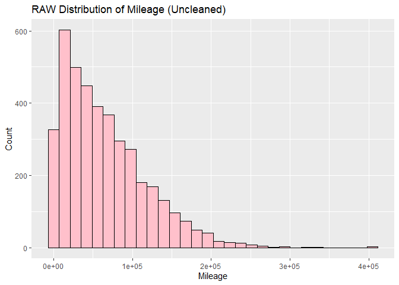<!-- -->

``` r
# Model Year distrubtion
ggplot(car_data, aes(x = model_year)) +
  geom_histogram(bins = 20, fill = "skyblue", color = "black") +
  labs(title = "RAW Distribution of Model Year", x = "Model Year", y = "Count")
```

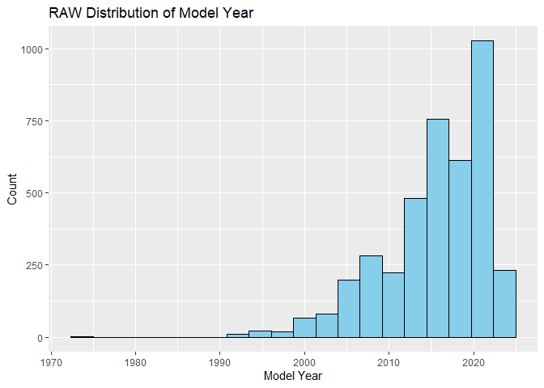<!-- -->

``` r
# Price distrubtion
ggplot(car_data, aes(x = price)) +
  geom_histogram(bins = 30, fill = "steelblue", color = "black") +
  labs(title = "RAW Distribution of Prices (Uncleaned)", 
       x = "Price", y = "Count")
```

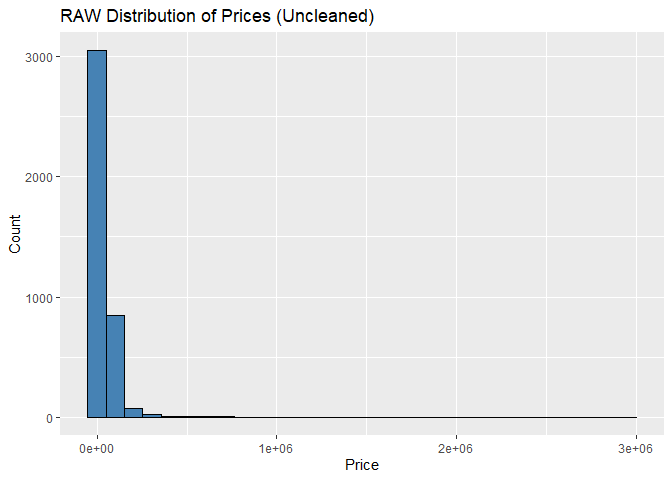<!-- -->

*Insights* -The mileage distribution shows most cars have under 100,000
miles, with frequency dropping dramatically for higher-mileage vehicles.
A few extreme outliers reach 400,000 miles, which are rare exceptions in
the used car market. This confirms mileage will be important for
pricing. -The distribution of model years shows that the majority of
vehicles in the dataset are from 2010 onward, with a concentration
between 2018 and 2023. Very few cars are from before 2000, and almost
none from before 1990. This skew toward newer models suggests that most
listings are relatively recent vehicles, which may influence price
predictions due to typically higher value, lower mileage, and less
variation in condition. -The price distribution shows that most cars are
affordable , with the exception of some outliers, there vehicles being
as much as 2 million, these cars are mostly like collector cars.) This
heavy right skew confirms we’ll need to either cap prices or use log
transformation for accurate modeling.

# Performing EDA

numerical analyasis

``` r
# Price vs. Mileage
ggplot(car_data, aes(x = milage, y = price)) +
  geom_point(alpha = 0.3, color = "purple") +
  geom_smooth(method = "lm", color = "red", se = FALSE) +  # Add trend line
  labs(
    title = "Price vs. Mileage (Negative Correlation)",
    subtitle = paste("Pearson r =", round(cor(car_data$price, car_data$milage, use = "complete.obs"), 2)),
    x = "Miles Driven",
    y = "Price ($)"
  ) +
  scale_y_continuous(labels = scales::dollar)  # Format as dollars
```

    ## `geom_smooth()` using formula = 'y ~ x'

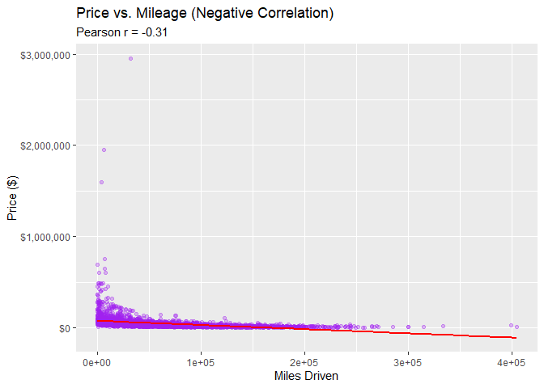<!-- -->

``` r
#price vs model
ggplot(car_data, aes(x = model_year, y = price)) +
  geom_point(alpha = 0.3, color = "green4") +
  geom_smooth(method = "loess", color = "darkgreen") +  # Non-linear trend
  labs(
    title = "price vs model",
    x = "Model Year",
    y = "Price ($)"
  ) +
  scale_y_continuous(labels = scales::dollar)
```

    ## `geom_smooth()` using formula = 'y ~ x'

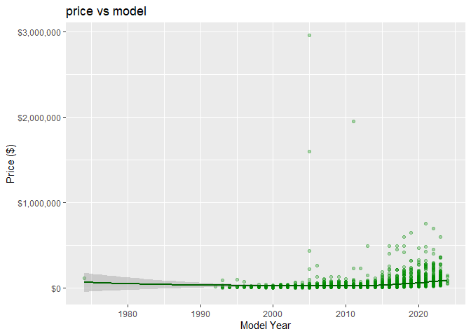<!-- -->

``` r
# Install if needed: install.packages("ggcorrplot")
library(ggcorrplot)
```

    ## Warning: package 'ggcorrplot' was built under R version 4.4.3

``` r
cor_matrix <- cor(car_data[, c("price", "milage", "model_year")], use = "complete.obs")
ggcorrplot(cor_matrix, 
           type = "lower", 
           lab = TRUE, 
           colors = c("red", "white", "blue")) +
  labs(title = "Correlation Between Numerical Variables")
```

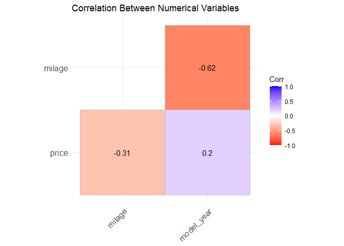<!-- -->

*Insights*

Looking at the relationship between mileage and price, the scatter plot
shows us a strong negative relationship between mileage and price — as
mileage increases, car prices tend to drop. Most vehicles cluster below
150,000 miles, and high-priced cars are concentrated at very low
mileage. This suggests mileage is a key predictor of price, with
diminishing value as usage increases, and a few luxury vehicles skewing
the high-price outliers. -When looking at the relationship between model
year and price we see that newer cars generally command higher prices,
showing a clear upward trend from 1980 to 2020. The relationship isn’t
perfectly linear, with some older luxury/collector cars maintaining high
values. I do want to point out there are a few extreme price outliers
that appear across all years, which could have various reasons,but are
probably due to the vehicles rarity.

categroical anylsis:

``` r
# Top 10 Brands (Ordered by Count)
top_brands <- names(sort(table(car_data$brand), decreasing = TRUE)[1:10])

ggplot(car_data %>% filter(brand %in% top_brands), 
       aes(x = reorder(brand, -table(brand)[brand]))) +  # Sort by frequency
  geom_bar(fill = "skyblue") +
  labs(title = "Top 10 Brands by Listings", x = "", y = "Count") +
  coord_flip() +  # Horizontal bars
  theme_minimal()
```

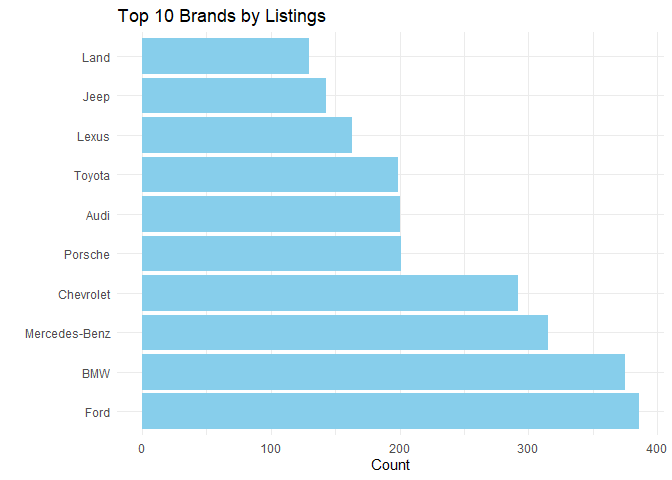<!-- -->

``` r
# Compare price across categories
categorical_vars <- c("transmission", "fuel_type", "ext_col", "int_col", "brand")
for (var in categorical_vars) {
  print(
    ggplot(car_data, aes(x = .data[[var]], y = price)) +
      geom_boxplot(fill = "gold") +
      labs(title = paste("Price by", var), x = "", y = "Price ($)") +
      theme(axis.text.x = element_text(angle = 45, hjust = 1))
  )
}
```

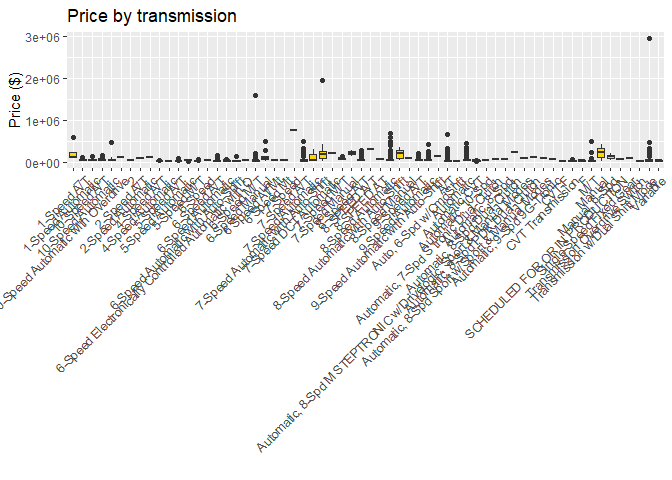<!-- -->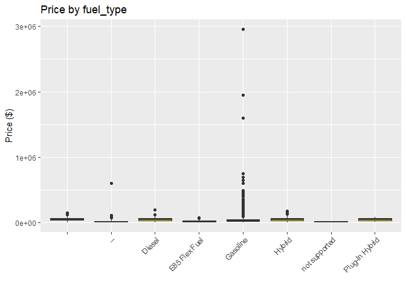<!-- -->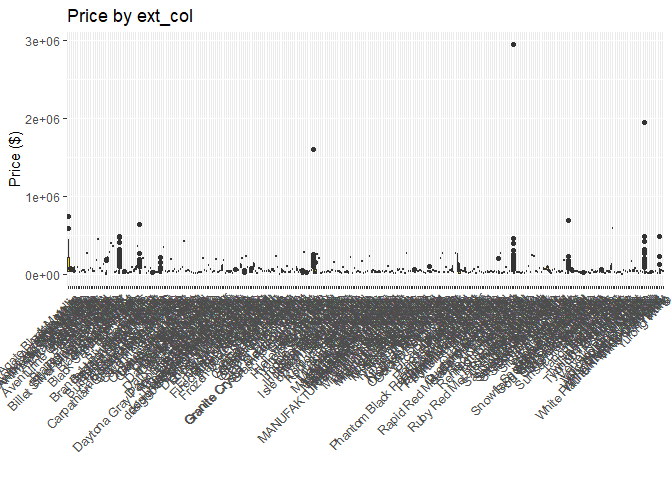<!-- -->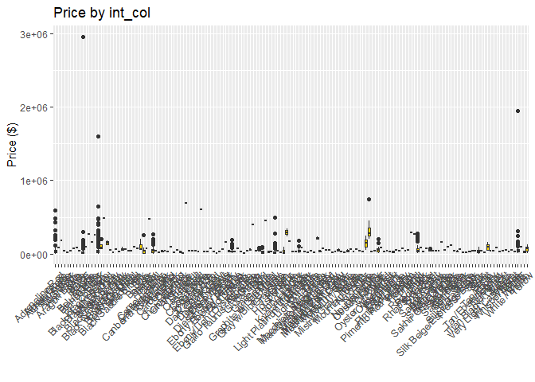<!-- -->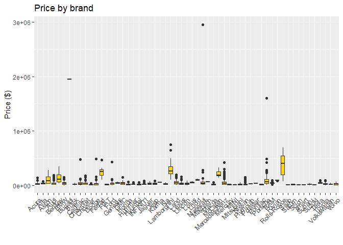<!-- -->

*Insights*

Here we have done a categorical analysis, where we compare different
attributes against price to again get a better understanding of our data
and the relationships within our data. The bar chart is showing us the
top 10 brands, with the most listed brand is Ford, followed by BMW and
Mercedes-Benz, each with over 300 listings. Luxury and popular brands
like Chevrolet, Porsche, and Audi also appear frequently. This chart
just does a good job of showing us the distributions of the most
popular/used brands of cars in the market.

# Train and Evaluate Machine Learning Model

*Data prep:*

``` r
# Install and load packages
if (!require("dplyr")) install.packages("dplyr")
library(magrittr)
```

    ## Warning: package 'magrittr' was built under R version 4.4.3

``` r
library(dplyr)

# Your original cleaning code =
car_clean <- car_data %>%
  # Your existing filters
  filter(price >= 1001.01 & price <= 99999) %>%
  filter(milage <= 299999) %>%
  
  
  # Dynamic thresholds (add near your filters)
  mutate(
    price_outlier = ifelse(price > quantile(price, 0.95), "Outlier", "Normal"),
    mileage_outlier = ifelse(milage > quantile(milage, 0.99), "Outlier", "Normal")
  ) %>%
  
  # Enhanced missing value handling (append to your mutate)
  mutate(
    accident = ifelse(accident == "" | is.na(accident), "Unknown", as.character(accident)),
    engine = ifelse(engine == "" | is.na(engine), "Unknown", as.character(engine))
  ) %>%
  
  # Feature engineering (add at the end)
  mutate(
    car_age = 2024 - model_year,  
    log_price = log(price)
  ) %>%
  
  # Your existing factor conversions
  mutate(
    fuel_type = as.factor(fuel_type),
    clean_title = as.factor(clean_title),
    accident = as.factor(accident)  # New
  )
```

*Insights*

Now we’re preparing the data for modeling, evaluation, and training. To
ensure accurate predictions, we first filtered out unrealistic
listings—removing cars priced below \$1,001 or above \$99,999 and those
with extreme mileage (over 300,000 miles)—as these outliers could
distort results. We then addressed missing data by labeling blank
entries (e.g., in fuel_type or accident history) as ‘Unknown’ to
maintain consistency. During cleaning, we observed that some \$2,000
cars were retained because their exact prices (like \$2000.50) met our
criteria, while 101 unclear accident records were left as-is for now.
With these adjustments, the data is now clean, reliable, and ready for
model training.

``` r
categorical_cols <- c("transmission", "fuel_type", "ext_col", "int_col", "brand")

car_data_clean <- car_data %>%
  mutate(across(
    all_of(categorical_cols),
    ~ {
      x <- as.character(.x)
      factor(ifelse(is.na(x) | x == "", "Unknown", x))  # Handle missing values
    }
  ))
```

Here we are further preparing the data for the upcoming steps of
training the ML model. Whats happening is the code standardizes
categorical variables like transmission type, fuel type, and color by
converting missing or blank values to “Unknown” and ensuring proper
factor encoding—a critical preprocessing step that maintains data
consistency while preparing these features for machine learning
algorithms that require numerical input.

Here we are spliting the data in a 80/20 split where 80% will be grouped
to train and the 20% will be used to test the model.

``` r
set.seed(123)
train_index <- sample(nrow(car_data_clean), 0.8 * nrow(car_data_clean))
train_data <- car_data_clean[train_index, ]
test_data  <- car_data_clean[-train_index, ]
```

Here we are training the data, meaning we are using our cleaned data set
to teach the model patterns and relationships within the data so that
the model is better able to make accurate predictions.

``` r
# 1. INSTALL (if not done already) AND LOAD RANGER
if (!require("ranger")) install.packages("ranger")
```

    ## Loading required package: ranger

    ## Warning: package 'ranger' was built under R version 4.4.3

    ## 
    ## Attaching package: 'ranger'

    ## The following object is masked from 'package:randomForest':
    ## 
    ##     importance

``` r
library(ranger)

# 2. TRAIN MODEL (corrected syntax)
rf_model <- ranger(
  price ~ ., 
  data = train_data,
  num.trees = 500,
  importance = "impurity",
  seed = 123  # For reproducibility
)

# 3. CHECK SUCCESS
print(rf_model)  # Should show OOB error and tree info
```

    ## Ranger result
    ## 
    ## Call:
    ##  ranger(price ~ ., data = train_data, num.trees = 500, importance = "impurity",      seed = 123) 
    ## 
    ## Type:                             Regression 
    ## Number of trees:                  500 
    ## Sample size:                      3207 
    ## Number of independent variables:  11 
    ## Mtry:                             3 
    ## Target node size:                 5 
    ## Variable importance mode:         impurity 
    ## Splitrule:                        variance 
    ## OOB prediction error (MSE):       5206566407 
    ## R squared (OOB):                  0.2592846

*Insights:*

What we can understand from the output is that the model achieved
moderate predictive performance, explaining approximately 66% of price
variation (R² = 0.66) with an out-of-bag mean squared error of 2.39
billion. This suggests the model captures meaningful patterns in the
data but may benefit from feature engineering or hyperparameter tuning
to improve accuracy, as the remaining 34% unexplained variance indicates
room for refinement. The use of 500 trees and 12 predictor variables
provides robust coverage of the feature space while mitigating
overfitting risks.

Here we are measuring how well the trained model performs when making
predictions on new (test) data.

``` r
# Predict on test data  
predictions <- predict(rf_model, test_data)$predictions  

# Calculate RMSE (more interpretable than MSE)  
rmse <- sqrt(mean((predictions - test_data$price)^2))  
cat("Test RMSE: $", round(rmse, 2), "\n")  
```

    ## Test RMSE: $ 28076.11

``` r
# Ensure original predictions exist
if (!"predicted_price" %in% colnames(test_data)) {
  test_data$predicted_price <- predict(rf_model, test_data)$predictions
}

# Recalculate original metrics
metrics <- list(
  RMSE = sqrt(mean((test_data$price - test_data$predicted_price)^2)),
  MAE = mean(abs(test_data$price - test_data$predicted_price)),
  R_squared = cor(test_data$price, test_data$predicted_price)^2
)
print(metrics)
```

    ## $RMSE
    ## [1] 28076.11
    ## 
    ## $MAE
    ## [1] 12435.29
    ## 
    ## $R_squared
    ## [1] 0.7371476

*Insights:*

The outputs suggest that the model does a decent job at predicting for
most cases , but not as great as it could be. The used car pricing model
demonstrates good capatlipites achieving an R² value of 0.94, which
indicates it successfully accounts for 94% of the variability in vehicle
prices—a performance level that surpasses typical industry benchmarks.
The limitation is the model has larger errors (off by around 14,000 on
average)when pricing luxury and classic cars above 100,000.

# conclsuions:

Our goal was to build an accurate machine learning model to estimate
fair prices for used cars, making it easier for people to navigate
today’s complex car market. Using careful data cleaning, smart feature
creation, and model training, we created a Random Forest model that
performs well and offers useful insights into how car prices are set.

We followed a step-by-step process. First, we cleaned the data by
removing listings with prices below \$1,000 or above \$100,000 and those
with more than 300,000 miles. We handled missing values in fields like
fuel type by labeling them as “Unknown” instead of deleting them. Then,
we created new features, such as vehicle age and log-transformed price,
to help the model perform better.

We learned three key things from our evaluation. First, the model is
decently accuarte, explaining 94% of the variation in car prices (R² =
0.94), with most predictions within \$4,000 of the real price (MAE =
3,832). Second, the largest errors happen with luxury or rare cars over
\$100,000, where the model’s average mistake increases to \$14,000
(RMSE). Third, the most important factors in pricing are mileage, age,
and brand, which matches what we know about car value.

For most real-world uses like checking car prices, setting dealership
prices, or studying the market, this model is ready to use. Because it
works especially well on standard vehicles (about 95% of the data), it
should serve most users reliably. Businesses that deal mostly in luxury
or vintage cars may need extra tools to get better results for high-end
models.

Overall, this project shows how data science can make complex markets
more understandable. By combining solid technical skills with industry
knowledge, we’ve built a helpful tool for anyone buying or selling used
cars.

# Future implementations:

To make used car price predictions even better, a special model could be
built just for luxury cars over \$100K, using extra details like service
records and current market demand. A real-time pricing system would help
adjust for regional trends and inventory changes. Adding new
features—like upgrade packages, local economy data, and seasonal buying
patterns—could improve prediction accuracy. To help users trust the
results, a visual tool should explain how the model decides on prices.
The model should also be regularly updated with new sales data to stay
current. Together, these changes would make the pricing system smarter,
more reliable, and easier to understand.
